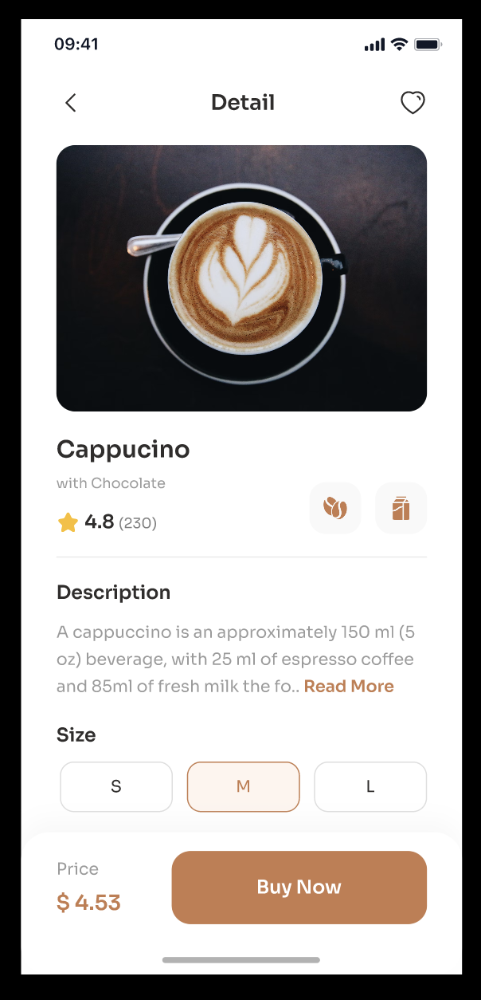

# TBC-Assignment-12
TBC IT Academy | iOS development Course | Module 2 | Assignment #12

## Assignment concept

This assignment aims to become more skilled at using storyboards and applying AutoLayout. The main task is to create a storyboard from a Figma design file and fine-tune specific UI element properties with code.

The assignment covers the following topics: 
* Size Classes
* Auto Layout 
* UIStackView
* Constraints

> The deadline of this task is: 23/10/2023, 10:00. 

